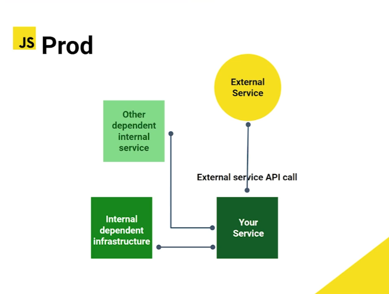
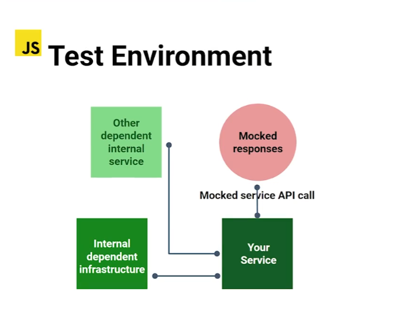

**[Curso de Introducción al Testing con JavaScript](./../README.md)**

# Mocking, Stub, doubles

### DOUBLES:
Son elementos que nos sirven para simular atributos, comportamientos, métodos, en nuestro entorno de pruebas. Existen las siguientes terminologías como **Mocking, Stub, fake, dummies, doubles**; la idea principal es que utilizar elementos que nos sirvan para reemplazar ciertos comportamientos en nuestra prueba.


Términos usados en la industria:

* __Dummy__: Son datos ficticios y se usan para rellenar información.

* __Fake__: Simulan un objeto real y sirven para suplantar ciertos datos y comportamientos.

* __Stubs__: Proveen respuestas preparadas y se pueden llamar durante el test para simular un comportamiento.

* __Spies__: Pueden ser `Stub` pero puedo recolectar información de como fue llamado.

* __Mocks__: `Stub` + `Spies`, a veces pueden ya estar pre-programados.

### Prod Environment

### Test Environment


## Gererar Fake Data
Para generar datos falsos, vamos usar [FakerJs](https://fakerjs.dev/)

Despues de instalar `FakerJs`, debemos agregar en el `package.json`, dentro de `devDependencies`:
```
"@faker-js/faker": "^9.9.0",
```
